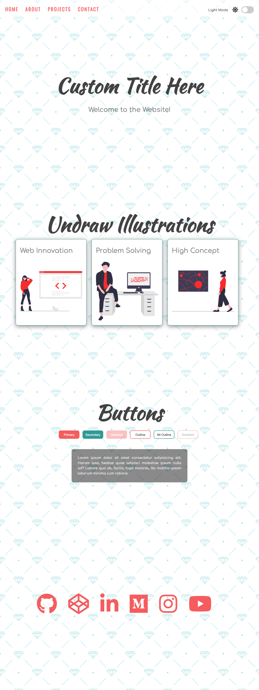
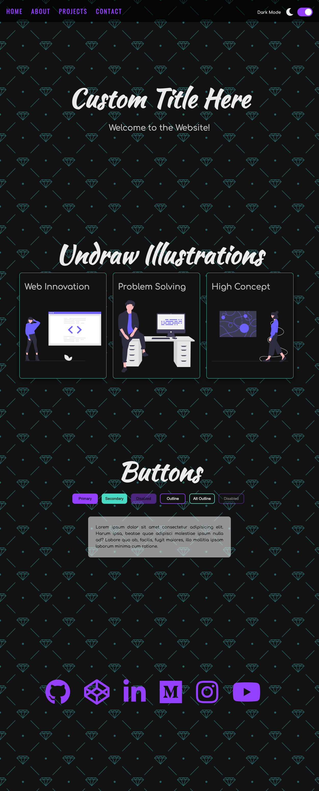

# Light Dark Mode

This is a simple website template that demonstrates a light-dark mode toggle functionality. It allows users to switch between light and dark themes for an enhanced user experience. The project includes HTML, CSS, and JavaScript files.

## Preview

## Features

- Light and dark mode toggle switch.
- Navigation menu with smooth scrolling.
- Sections for home, about, projects, and contact.
- Images and text dynamically change based on the selected mode.
- Buttons with different styles.
- Social icons for linking to various platforms.

## Technologies Used

- HTML
- CSS
- JavaScript
- Font Awesome (v5.10.2)

## How to Use

1. Clone this repository to your local machine or download the ZIP file.
2. Open the `index.html` file in your preferred web browser.
3. Click on the toggle switch to switch between light and dark modes.
4. Navigate through the different sections using the navigation menu.

## Customization

You can customize the project according to your needs:

- **Title**: Replace the text "Custom Title Here" in the `index.html` file with your desired title.
- **Navigation Links**: Modify the links in the navigation menu in the `index.html` file.
- **Sections**: Customize the content and structure of each section in the `index.html` file.
- **Images**: Replace the images in the `img` folder with your own images.
- **Styling**: Modify the `style.css` file to change the visual appearance of the website.
- **JavaScript**: Customize the JavaScript code in the `script.js` file to add new functionality or modify existing behavior.

## License

This project is licensed under the MIT License. Feel free to use and modify it for your own purposes.

## Credits

- Illustrations: [unDraw](https://undraw.co/)
- Icons: [Font Awesome](https://fontawesome.com/)

## Acknowledgements

This project was inspired by the concept of light-dark mode toggles in modern web design. It serves as a starting point for creating websites with dynamic themes.
